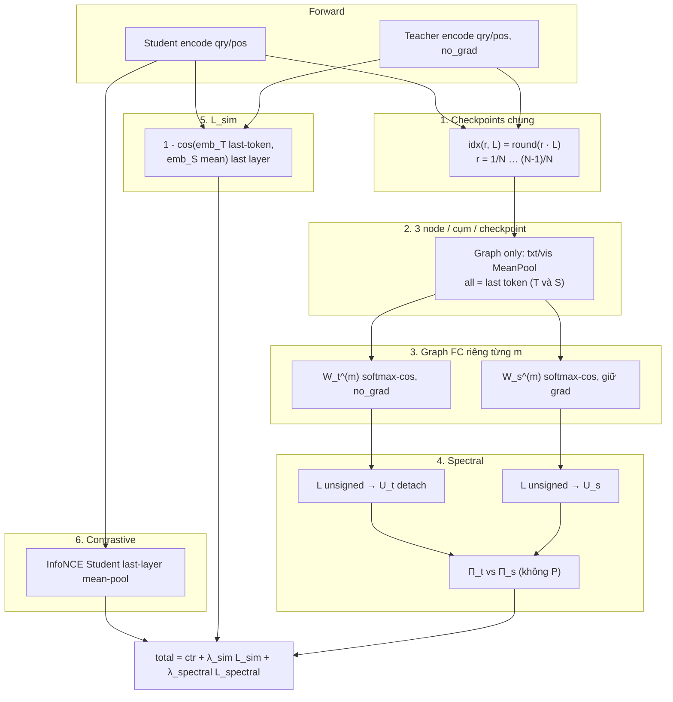

# SEGDLoss — 3-node semantic graph, multi-layer spectral + $\mathcal{L}_{\text{sim}}$

Tài liệu theo dõi cấu trúc loss hiện tại của [`src/criterions/segd_loss.py`](../src/criterions/segd_loss.py).

Mỗi sample (mỗi cụm query / positive) được rút xuống **3 super-node semantic cố định** (`R_txt`, `R_vis`, `R_all`) tại **cùng bộ checkpoint layer theo relative depth**. Teacher và Student có cùng số node, cùng ý nghĩa, cùng thứ tự → correspondence 1-1, **không cần ma trận chiếu $P$**.

`contrastive_loss` và $\mathcal{L}_{\text{sim}}$ dùng **last-layer** `encode_input` (không checkpoint): Student mean-pool, Teacher last-token. Contrastive chỉ InfoNCE phía Student; $\mathcal{L}_{\text{sim}}$ so hai embedding T↔S.

Script train mẫu: [`scripts/cls/train_SEGD_fastvlm.sh`](../scripts/cls/train_SEGD_fastvlm.sh).

---

## Công thức tổng

$$
\mathcal{L} = \mathcal{L}_{\text{contrastive}} + \lambda_{\text{sim}} \mathcal{L}_{\text{sim}} + \lambda_{\text{spectral}} \mathcal{L}_{\text{spectral}}
$$

| Thành phần | Trọng số mặc định | Mô tả ngắn |
|------------|-------------------|------------|
| `contrastive_loss` | 1.0 (implicit) | Symmetric InfoNCE (q→p + p→q) trên Student `encode_input` (`--pooling mean`). Teacher không tham gia. |
| $\mathcal{L}_{\text{sim}}$ | `segd_lambda_sim` | $1-\cos$ hai embedding last-layer: Teacher **last-token** vs Student **mean-pool** (qry + pos) |
| $\mathcal{L}_{\text{spectral}}$ | `segd_lambda_spectral` | Trung bình projector Frobenius trên 3 graph checkpoint (không $P$) |

**Không còn:** Star-Bridge, attention top-k, signed Laplacian, FRA / char-overlap / $P$, `kd_weight`, layer ~80% (`segd_depth_ratio` / `segd_attn_window`), CKA, Semantic Grounding, per-sample SEKD cũ.

---

## Luồng tính toán tổng thể

```
[Teacher forward, no_grad] ─┐
                            ├─ hidden_states ─► checkpoints 25/50/75% (mỗi model tự tính idx)
[Student forward] ──────────┘         │
                                      ├─ graph node: R_txt/R_vis = MeanPool; R_all = last token (T và S)
                                      ├─ graph FC cosine-softmax (riêng từng m) ─► L unsigned ─► eigh ─► Π
                                      ├─ L_spectral = mean_m ||Π_t − Π_s||_F² / N
encode_input last layer ── Student mean + Teacher last-token ──────────────► L_sim (1-cos)
Student encode_input mean-pool ────────────────────────────────────────────► InfoNCE (Teacher không dùng)
```



---

## 1. Layer checkpoint theo relative depth

**Đây là cơ chế chọn layer duy nhất** cho graph / $\mathcal{L}_{\text{spectral}}$. Thay thế hẳn `segd_depth_ratio` / `segd_attn_window`. Contrastive và $\mathcal{L}_{\text{sim}}$ dùng last layer `encode_input`, không dùng checkpoint.

Hyperparameter `segd_num_align_layers` (mặc định `4`). Với $N$ đoạn bằng nhau, lấy **$N-1$ checkpoint nội bộ** tại $\frac{1}{N},\frac{2}{N},\ldots,\frac{N-1}{N}$ (không lấy 0% và 100%). $N=4$ → **3 checkpoint** tại 25%, 50%, 75%.

Mỗi model tự tính index theo số layer **của chính nó** (Python `round()`, half-to-even):

$$
\text{idx}(r, L) = \operatorname{round}(r \cdot L)
$$

HuggingFace `hidden_states` gồm embeddings + $L$ layer output → code lấy $L = \texttt{len(hidden\_states)} - 1$, rồi index `hidden_states[idx]` (bỏ embeddings tại 0). **Một layer đúng**, không mean window.

| Model | Số layer $L$ | 25% | 50% | 75% |
|-------|-------------|-----|-----|-----|
| Teacher | 42 | 10 | 21 | 32 |
| Student | 24 | 6 | 12 | 18 |

Cặp align theo **thứ tự tỷ lệ**, không theo index tuyệt đối: Teacher `[10, 21, 32]` ↔ Student `[6, 12, 18]`.

---

## 2. Node representation — 3 node / cụm / checkpoint

Tại mỗi checkpoint $m$, mỗi cụm (query và positive **riêng**) tạo **3 super-node** từ token native (pad đã loại khi extract). Layout extract:

| Bên | Sequence | Vision | Text |
|-----|----------|--------|------|
| Teacher (left pad) | `[pad \| vision \| text]` | patch token | subword cuối sequence |
| Student (right pad) | `[vision \| text \| pad]` | patch đầu sequence | subword sau vision |

Thứ tự token **trong cụm** (sau khi bỏ pad) luôn `[H_{\text{vis}} \mid H_{\text{txt}}]`.

### 2.1 Định nghĩa từng node

$$
\begin{aligned}
R_{\text{txt}}^{(m)} &= \operatorname{Pool}_{\text{txt}}(H_{\text{txt}}^{(m)}) \\
R_{\text{vis}}^{(m)} &= \operatorname{Pool}_{\text{vis}}(H_{\text{vis}}^{(m)}) \quad\text{(chỉ khi } N_v>0\text{)} \\
R_{\text{all}}^{(m)} &= \operatorname{Pool}_{\text{all}}([H_{\text{vis}}^{(m)}; H_{\text{txt}}^{(m)}])
\end{aligned}
$$

$R_{\text{all}}$ pool trên **chuỗi ghép vision+text** (thứ tự sequence), **không** phải $(R_{\text{txt}}+R_{\text{vis}})/2$.

`Pool = MeanPool` = trung bình mọi token hợp lệ của nhóm. `Pool = LastToken` = token cuối của nhóm (với $R_{\text{all}}$: token cuối của `[vis \| txt]`, thường là last text token).

### 2.2 Pooling trên graph (Teacher = Student)

Chỉ dùng cho graph / $\mathcal{L}_{\text{spectral}}$. $\mathcal{L}_{\text{sim}}$ **không** lấy node txt/vis/all.

| Node | Graph / $\mathcal{L}_{\text{spectral}}$ (T và S giống nhau) |
|------|-----------------------------------------------------------|
| $R_{\text{txt}}$ | MeanPool($H_{\text{txt}}$) |
| $R_{\text{vis}}$ | MeanPool($H_{\text{vis}}$) |
| $R_{\text{all}}$ | **LastToken**($[H_{\text{vis}}; H_{\text{txt}}]$) |

$R_{\text{all}}$ trên graph là last token của cụm (thường last text), không phải mean toàn sequence.

### 2.3 Số node và thứ tự stack

Không vision: **bỏ** $R_{\text{vis}}$ (không placeholder). Graph $R_{\text{all}}$ = last token của text còn lại (khác $R_{\text{txt}}$ = mean text).

Query 3 node + positive 3 node ⇒ **6 node/sample/checkpoint** khi mọi cụm có ảnh:

$$
N_{\text{total}}^{T,(m)} = N_{\text{total}}^{S,(m)} = 6B
\qquad\text{(ít hơn nếu một số cụm không có ảnh)}
$$

Thứ tự stack (giống Teacher và Student, 1-1 không $P$):

```
sample i:  txt_q, vis_q?, all_q, txt_p, vis_p?, all_p
```

`vis` chỉ thêm khi **cả hai phía** đều có vision token. Tính độc lập từng checkpoint $m$.

---

## 3. Graph — fully-connected, một graph / checkpoint

Tại mỗi $m$, một graph đầy đủ trên toàn bộ node của batch **tại layer đó** (không nối chéo checkpoint, không top-k, không attention):

$$
w_{ij}^{(m)} = \frac{\exp\big(\cos(X_i^{(m)}, X_j^{(m)})/\tau\big)}{\sum_{k \neq i} \exp\big(\cos(X_i^{(m)}, X_k^{(m)})/\tau\big)}
$$

- $\tau$ = `segd_tau_graph` (mặc định `1.0`), dùng chung 3 checkpoint.
- Softmax theo hàng không đối xứng → bắt buộc $W^{(m)} \leftarrow \tfrac12(w^{(m)}+w^{(m)\top})$.
- Không cạnh âm (bỏ `segd_lambda_neg`, `segd_k_neg`).
- Teacher: `no_grad`. Student: giữ gradient (mean-pool txt/vis + last-token $R_{\text{all}}$) → cosine → softmax → Laplacian → eigh, tại cả 3 checkpoint.

---

## 4. Spectral distillation — riêng từng checkpoint, rồi trung bình

$N_T = N_S$ và node thứ $r$ tương ứng 1-1 → **không $P$** (bỏ FRA, char-overlap, block-diagonal $P$).

1. Laplacian **unsigned**:

$$
D_{ii}^{(m)} = \sum_j W_{ij}^{(m)}, \qquad
L^{(m)} = I - (D^{(m)})^{-1/2} W^{(m)} (D^{(m)})^{-1/2}
$$

   ($D_{ii}>0$ vì softmax — không dùng $|W_{ij}|$.)

2. `eigh(L_t)` `no_grad`, `eigh(L_s)` giữ grad.
3. $k_m$ theo eigengap **riêng từng checkpoint** (`select_k_by_eigengap`, `segd_k_eigen`, `segd_k_eigen_min`); $k = \max(k_{\min}, \min(k_t, k_s))$ clamp theo kích thước graph.
4. Projector (tránh sign/rotation ambiguity của eigenvector):

$$
\Pi_t^{(m)} = U_t^{(m,k_m)} {U_t^{(m,k_m)}}^{\top}, \qquad
\Pi_s^{(m)} = U_s^{(m,k_m)} {U_s^{(m,k_m)}}^{\top}
$$

$$
\mathcal{L}_{\text{spectral}}^{(m)} = \frac{1}{N^{(m)}}\big\|\Pi_t^{(m)} - \Pi_s^{(m)}\big\|_F^2
$$

$$
\mathcal{L}_{\text{spectral}} = \frac{1}{M}\sum_{m=1}^{M} \mathcal{L}_{\text{spectral}}^{(m)}
\quad (M=3 \text{ với } N=4)
$$

Chi phí: 3 graph + 3 `eigh` mỗi bước, mỗi cái $O((6B)^2)$ — rẻ hơn graph native-token cũ $O((B\cdot N_{\text{tok}})^2)$.

---

## 5. $\mathcal{L}_{\text{sim}}$ — hai embedding last-layer

**Không** dùng node graph (`txt` / `vis` / `all`). Chỉ so **một vector embedding / cụm** từ `encode_input` **last hidden layer**:

- Teacher: pooling mặc định **last-token** (`teacher_pooling=last`) → `teacher_qry_reps`, `teacher_pos_reps` (`no_grad` / detach).
- Student: `--pooling mean` → `student_qry_reps`, `student_pos_reps`.

$$
\mathcal{L}_{\text{sim}}
= \tfrac12 \Big[
(1-\cos(e_T^{q}, e_S^{q}))
+ (1-\cos(e_T^{p}, e_S^{p}))
\Big]
$$

trung bình trên batch. Không checkpoint, không tách modal.

Cosine yêu cầu **cùng hidden dim** Teacher/Student; không có projector trong loss này.

---

## 6. Contrastive — Student mean, Teacher không tham gia

`--pooling mean` (Student `encode_input` last layer). Teacher embedding last-token **chỉ** dùng cho $\mathcal{L}_{\text{sim}}$, không vào InfoNCE.

$$
\mathcal{L}_{\mathrm{ctr}}
= \tfrac{1}{2}\Big[
\mathrm{CE}\!\left(\frac{\hat{R}_q \hat{R}_p^{\top}}{\tau}, \mathrm{arange}(B)\right)
+ \mathrm{CE}\!\left(\frac{\hat{R}_p \hat{R}_q^{\top}}{\tau}, \mathrm{arange}(B)\right)
\Big]
$$

`bidirectional_infonce_loss` — L2-normalize; temperature `distiller.temperature`. Reps từ Student **last hidden layer**, không dùng $R$ checkpoint.

---

## 7. Edge cases

| Tình huống | Xử lý |
|------------|--------|
| Sample / cụm không có ảnh ($N_v=0$) | Bỏ hẳn $R_{\text{vis}}^{(m)}$ tại **mọi** checkpoint (không placeholder/mask). Hai phía bỏ cùng node → vẫn 1-1. |
| $R_{\text{all}}$ khi không vision | Graph: last text token (khác $R_{\text{txt}}$ = mean text). $\mathcal{L}_{\text{sim}}$ không dùng node này. |
| $\mathcal{L}_{\text{sim}}$ | Chỉ embedding last-layer; không phụ thuộc có/không ảnh |
| Graph $N<2$ | Bỏ spectral tại checkpoint đó (loss 0) |
| Hidden dim Teacher ≠ Student | $\mathcal{L}_{\text{sim}}$ cosine không tính được — raise rõ ràng (spectral vẫn cùng $N$ node) |

---

## 8. Hyperparameters

Nguồn: [`src/arguments.py`](../src/arguments.py), script [`train_SEGD_fastvlm.sh`](../scripts/cls/train_SEGD_fastvlm.sh).

**Đổi tên hẳn, không backward-compat với `kd_weight` cho SEGD.** `kd_weight` vẫn tồn tại trên CLI vì các loss khác (SGD/span/…) còn dùng; `SEGDLoss` **không đọc** `kd_weight`.

| Tham số | CLI | Mặc định | Ghi chú |
|---------|-----|----------|---------|
| `segd_lambda_sim` | `--segd_lambda_sim` | `1.0` | Scale $\mathcal{L}_{\text{sim}}$ |
| `segd_lambda_spectral` | `--segd_lambda_spectral` | `1.0` | Scale $\mathcal{L}_{\text{spectral}}$ (thay `kd_weight`) |
| `segd_tau_graph` | `--segd_tau_graph` | `1.0` | Softmax temperature graph FC, chung mọi checkpoint |
| `segd_num_align_layers` | `--segd_num_align_layers` | `4` | $N$ đoạn → $N-1$ checkpoint (25/50/75% khi $N=4$) |
| `segd_k_eigen` | `--segd_k_eigen` | `0` | Cap eigengap $k$ (`0` = không cap ngoài $n-1$), per checkpoint |
| `segd_k_eigen_min` | `--segd_k_eigen_min` | `16` | Floor eigengap $k$, per checkpoint |
| `pooling` | `--pooling` | `mean` | Contrastive Student last-layer (Teacher default `last`, không dùng) |

**Đã xóa khỏi SEGDLoss** (flag CLI còn parse nhưng `[unused]`): `segd_depth_ratio`, `segd_attn_window`, `segd_intra_topk`, `segd_tau_intra`, `segd_tau_local`, `segd_lambda_neg`, `segd_k_neg`, `segd_bridge_temperature`, `segd_use_graph_reps_contrastive`. Patch size không dùng cho graph mới.

**Batch size:** mỗi checkpoint $6B\times 6B$, nhân 3 `eigh`. Rẻ hơn graph native-token; script v2 mặc định `B=16`. Có thể tăng so với thiết kế dense cũ.

---

## 9. Metric log

Định nghĩa: `KD_LOSS_METRIC_KEYS["segd_loss"]` trong [`main.py`](../main.py).

| Key | Ý nghĩa |
|-----|---------|
| `loss` | Total = contrastive + λ_sim L_sim + λ_spectral L_spectral |
| `contrastive_loss` | Symmetric InfoNCE student |
| `sim_loss` | $\mathcal{L}_{\text{sim}}$ raw |
| `segd_loss` / `spectral_kd_loss` | $\mathcal{L}_{\text{spectral}}$ raw (trung bình 3 checkpoint) |
| `sim_weighted` / `spectral_weighted` | Đóng góp thực vào total |
| `segd_lambda_sim` / `segd_lambda_spectral` | Hệ số scale |
| `batch_size` | $B$ local |
| `n_total` | Số node graph / checkpoint (cùng Teacher và Student) |
| `n_checkpoints` | $M$ (3 khi $N=4$) |
| `n_vis_nodes_qry` / `n_vis_nodes_pos` | Số cụm còn node vision |
| `segd_k_eigen` | $k$ trung bình các checkpoint |
| `segd_k_eigen_teacher` / `_student` | $k$ eigengap trung bình từng phía |
| `segd_k_eigen_{0,1,2}` | $k$ từng checkpoint |
| `segd_layer_teacher_{0,1,2}` / `segd_layer_student_{0,1,2}` | Index layer thực dùng |

---

## 10. Gradient / autograd

| Thành phần | Grad student? |
|------------|---------------|
| Teacher forward / $W_t$ / $U_t$ | ✗ (`no_grad` + detach) |
| Mean-pool $R$ student tại 3 checkpoint | ✓ |
| Edge weights cosine-softmax | ✓ |
| `eigh(L_s)` | ✓ (full dense) |
| $\mathcal{L}_{\text{sim}}$ | ✓ (qua $R_S$ only; $R_T$ detach) |
| Contrastive last-layer | ✓ |

Không còn attention, không còn $P$.

---

## 11. File liên quan

| File | Vai trò |
|------|---------|
| `src/criterions/segd_loss.py` | `SEGDLoss`, 3-node graph, unsigned Laplacian, spectral + sim |
| `src/criterions/sgd_loss.py` | Helpers extract vision/text tokens (tái dùng) |
| `src/criterions/__init__.py` | Registry `segd_loss` |
| `src/arguments.py` | Hyperparams `segd_*` |
| `src/model/model.py` | `encode_input` (hidden_states; attentions không cần) |
| `scripts/cls/train_SEGD_fastvlm.sh` | Script train mẫu |
| `main.py` | Metric keys, `kd_loss_type=segd_loss` |

---

## 12. So với Star-Bridge (bản trước)

| | Star-Bridge (cũ) | 3-node multi-layer (hiện tại) |
|--|------------------|-------------------------------|
| Node | Native vision/text token + $R_Q,R_P$ | 3 super-node semantic / cụm |
| $N_{\text{total}}$ | Khác nhau T/S (cần $P$) | Bằng nhau, 1-1 (không $P$) |
| Layer | 1 window ~80% | $N-1$ checkpoint relative depth, dùng chung graph+sim |
| Topology | Intra top-k attn, local-to-global, signed bridge | Fully-connected cosine-softmax / checkpoint |
| Laplacian | Signed ($D_{ii}=\sum|W_{ij}|$) | Unsigned ($D_{ii}=\sum W_{ij}$) |
| $\mathcal{L}_{\text{sim}}$ | Không có | $1-\cos$ embedding last-layer: Teacher last-token vs Student mean (qry+pos) |
| Contrastive | Last-layer mean (không đổi) | Student last-layer mean; Teacher không tham gia |
| Scale loss | `kd_weight` | `segd_lambda_sim` + `segd_lambda_spectral` |
